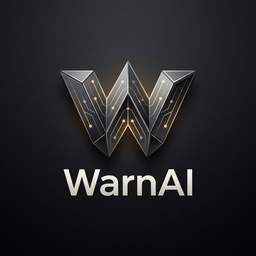

# WarnAI (warn.ai)
### Workspace-Aware Repository Normalization & Adaptive Inference AI

<p align="center">
  
</p>

<p align="center">
  <strong>Platform orkestrasi repositori mandiri, normalisasi berkas multi-format ke Clean Markdown, dan optimasi context engineering terpadu untuk model LLM lokal (100% Air-Gapped, Zero Cloud API).</strong>
</p>

<p align="center">
  
  
  
  
</p>

---

## 🌟 Daftar Fitur Utama

### 1. File Ingestion & Markdown Normalization Pipeline
* **Multi-Format Ingestion**: Menerima repositori berkas kode utuh (`.ZIP`), berkas teknis biner (`.PDF`, `.DOCX`, `.DOC`), dan lebih dari 20 format bahasa pemrograman (`.py`, `.ts`, `.js`, `.php`, `.go`, `.rs`, `.java`, `.cpp`, `.cs`, `.sql`, `.yaml`, `.json`, `.md`, dll).
* **Boilerplate Pruning Engine**: Memangkas komentar trivial, metadata biner, format styling tak berguna, dan memadatkan whitespace.
* **Standarisasi Clean Markdown**: Mengonversi setiap berkas menjadi representasi Markdown terstruktur yang sangat hemat token konteks.
* **Deterministic Project Skeleton**: Menghasilkan berkas hierarki struktur modul, pohon folder, dan tanda tangan fungsi/kelas secara instan (`project_skeleton.md`).

### 2. Semantic Pruning & Local Indexing Engine (No-Agent, Zero-API)
* **100% Offline & Mandiri**: Tanpa API key cloud pihak ketiga (zero OpenAI/Anthropic keys). Menjaga kerahasiaan dan privasi kode internal korporat.
* **FastEmbed ONNX Runtime**: Model dense vector embedding lokal `BAAI/bge-small-en-v1.5` (vektor 384 dimensi) yang sangat cepat di CPU maupun GPU.
* **Dual-Engine Hybrid Retrieval**: Menggabungkan ketajaman kata kunci leksikal (**Rank-BM25**) dengan kedalaman makna semantik (**Cosine Similarity Vektor**) menggunakan formula berbobot:
  $$\text{Score} = 0.45 \times \text{BM25}_{\text{norm}} + 0.55 \times \text{CosineSimilarity}$$

### 3. Local LLM Context Assembly & Inference Gateway
* **Context Budget Control**: Mengatur alokasi jumlah token input secara presisi (512 hingga 8192 token) agar tidak melampaui batas *context window* LLM lokal.
* **Dynamic Prompt Packing**: Memadatkan `project_skeleton.md` dan *top-k chunks* Markdown hasil pruning ke dalam prompt terpadu.
* **Local LLM REST Gateway**: Terintegrasi langsung dengan endpoint lokal (Ollama / `llama.cpp` / vLLM lokal) untuk model seperti `qwen2.5-coder`, `mistral`, atau `llama3.2`.

### 4. Tokenomics & Data Analytics
* **Analitik Kompresi Token**: Menghitung rasio reduksi ukuran berkas mentah vs Markdown bersih serta estimasi token yang dihemat menggunakan Pandas & NumPy.
* **NLP Topic Modeling (TF-IDF)**: Ekstraksi otomatis kata kunci dominan repositori menggunakan Scikit-Learn.
* **Latency Profiler**: Pencatatan profil latensi inferensi dan retrieval (Average, Median p50, Tail p95).
* **Breakdown Ekstensi**: Distribusi berkas, ukuran, dan token terindeks berdasarkan format berkas.

### 5. Workspace Project Isolation & Clean Markdown Exports
* **Isolasi Proyek (+ New Project)**: Reset workspace instan untuk memulai proyek baru tanpa risiko data repositori lama saling tercampur (*merged*).
* **Download Markdown ZIP**: Mengunduh seluruh berkas proyek yang telah dinormalisasi dan diubah ke format `.md` dalam satu arsip ZIP.
* **Download Context Bundle (.md)**: Mengunduh 1 file Markdown utuh (`warnai_context_bundle.md`) siap pakai untuk di-*drop* ke jendela LLM mana pun.
* **In-Browser Markdown Viewer**: Modal pop-up interaktif untuk melihat dan menyalin teks Markdown hasil konversi per berkas secara langsung.

### 6. Modern UI/UX Developer Workbench
* **Splash Menu Landing Portal** (`GET /`): Halaman pembuka interaktif dengan live status telemetry, navigasi kartu cepat, dan rangkuman arsitektur.
* **Developer Workbench** (`GET /workspace`): Dashboard presisi bertema **Obsidian Carbon & Electric Amber** (terinspirasi dari Linear.app, Raycast, dan Geist).
* **Lucide Icon Library**: Antarmuka bersih tanpa emoji amatir, menggunakan ikon SVG vektor resolusi tinggi.
* **Custom Logo & Favicon**: Identitas visual geometris "W" isometrik pada header aplikasi dan browser tab favicon.

---

## 🛠️ Arsitektur & Tech Stack

| Layer | Komponen / Pustaka | Fungsi Utama |
| :--- | :--- | :--- |
| **Web Orchestrator & UI** | Laravel 11 (PHP 8.3) & Blade | Routing, WorkspaceController, ContextAssemblyService, dan Splash Portal |
| **Styling & Icons** | Vanilla CSS & Lucide Icons | Obsidian & Amber design tokens, responsive layout, dan SVG iconography |
| **Document Normalizer** | Python 3.11 (FastAPI) | PyMuPDF, python-docx, AST parser, boilerplate pruning, skeleton generator |
| **Deep Learning Embedding** | FastEmbed (ONNX Runtime) | Model `BAAI/bge-small-en-v1.5` (dense vector 384 dimensi lokal) |
| **Lexical Search** | Rank-BM25 | Penyaringan leksikal kata kunci cepat deterministik |
| **Database & Vector Store** | PostgreSQL 16 + `pgvector` | Penyimpanan data relasional dan indeks vektor berdimensi 384 |
| **Task Queue & In-Memory** | Redis 7 + Laravel Queue Worker | Pemrosesan asynchronous antrean repositori berukuran besar |
| **Local Inference Server** | Ollama / llama.cpp REST | Server inferensi LLM internal (contoh: `qwen2.5-coder`) |
| **Data Analytics** | Pandas, NumPy, Scikit-Learn | Agregasi tokenomics, ekstraksi topik TF-IDF, dan latensi profiler |
| **Infrastruktur** | Docker & Docker Compose | 6 service terpadu (`nginx`, `laravel`, `worker`, `ai-engine`, `postgres`, `redis`) |

---

## 📁 Struktur Direktori

```text
WarnAI/
├── docker/
│   ├── laravel/
│   │   ├── Dockerfile
│   │   └── php.ini
│   ├── python-engine/
│   │   ├── Dockerfile
│   │   └── requirements.txt
│   └── nginx/
│       └── default.conf
├── backend-laravel/               # Web Orchestrator & API Gateway
│   ├── app/
│   │   ├── Http/Controllers/
│   │   │   ├── Controller.php
│   │   │   └── WorkspaceController.php
│   │   ├── Jobs/ProcessRepositoryJob.php
│   │   ├── Services/ContextAssemblyService.php
│   │   └── Models/WorkspaceProject.php
│   ├── database/migrations/       # Migrasi tabel cache, sessions, dan jobs
│   ├── public/
│   │   ├── css/app.css            # Stylesheet Obsidian & Electric Amber
│   │   ├── js/app.js              # Script interaktif & re-render Lucide
│   │   ├── images/logo.png        # Logo resmi WarnAI
│   │   └── favicon.ico            # Favicon tab browser
│   ├── resources/views/
│   │   ├── splash.blade.php       # Halaman Splash Menu Portal (GET /)
│   │   └── dashboard.blade.php    # Workbench Developer Dashboard (GET /workspace)
│   ├── routes/web.php
│   ├── artisan
│   └── composer.json
├── ai-engine-python/              # Document Processing & Local Embedding Engine
│   ├── app/
│   │   ├── normalizer/            # Multi-format Ingestion, Pruner, Skeleton Generator
│   │   │   ├── core.py
│   │   │   └── skeleton.py
│   │   ├── search/                # Hybrid Retrieval (BM25 + ONNX 384d Vectors)
│   │   │   ├── bm25.py
│   │   │   ├── embeddings.py
│   │   │   └── engine.py
│   │   ├── analytics/             # Pandas, NumPy & TF-IDF Analytics Engine
│   │   │   ├── tokenomics.py
│   │   │   ├── nlp_analytics.py
│   │   │   └── engine.py
│   │   ├── inference/             # Local LLM Context Packing & Gateway
│   │   │   └── gateway.py
│   │   └── main.py                # FastAPI endpoints & export stream
│   └── requirements.txt
├── docker-compose.yml             # Orkestrasi 6 kontainer
├── .env.example
├── WarnAI.md                      # Master Technical Specification
└── README.md
```

---

## 🚀 Panduan Menjalankan (Quick Start)

### 1. Prasyarat
* Docker & Docker Compose sudah terpasang di sistem operasi Anda.
* Port `80`, `8001`, `5432`, dan `6379` tidak sedang digunakan oleh aplikasi lain.

### 2. Konfigurasi Environment
Salin berkas konfigurasi template:
```bash
cp .env.example .env
```
*(Di Windows PowerShell: `Copy-Item .env.example .env`)*

### 3. Build & Jalankan Kontainer
Jalankan seluruh service dalam background:
```bash
docker compose up -d --build
```

### 4. Akses Aplikasi di Browser
Setelah container aktif, buka browser Anda di:
* **Splash Menu Portal:** [http://localhost](http://localhost)
* **Developer Workbench:** [http://localhost/workspace](http://localhost/workspace)
* **AI Engine Swagger API Docs:** [http://localhost:8001/docs](http://localhost:8001/docs)
* **Engine Health JSON:** [http://localhost:8001/health](http://localhost:8001/health)

---

## 📡 Ringkasan API Endpoint

| Method | Endpoint | Deskripsi |
| :--- | :--- | :--- |
| `GET` | `/` | Menampilkan Halaman Splash Menu Portal |
| `GET` | `/workspace` | Menampilkan Developer Workbench Dashboard |
| `GET` | `/api/health` | Status kesehatan engine lokal & embedding |
| `GET` | `/api/analytics` | Metrik tokenomics, latensi, dan topik TF-IDF |
| `POST` | `/api/normalize` | Mengunggah dan menormalisasi berkas/arsip ZIP (`replace=1` untuk proyek baru) |
| `POST` | `/api/search` | Pencarian hybrid context (BM25 + Cosine Vector) |
| `POST` | `/api/context/assemble` | Merakit prompt kontekstual dalam batas token budget |
| `POST` | `/api/infer` | Menjalankan penalaran inferensi pada LLM lokal internal |
| `GET` | `/api/skeleton` | Mendapatkan teks `project_skeleton.md` |
| `POST` | `/api/workspace/reset` | Mengosongkan memori workspace untuk proyek baru |
| `GET` | `/api/export/zip` | Mengunduh seluruh berkas normalisasi dalam bentuk ZIP Markdown |
| `GET` | `/api/export/bundle` | Mengunduh satu file tunggal Markdown (`warnai_context_bundle.md`) |
| `GET` | `/api/file/markdown?path={p}` | Mendapatkan teks Clean Markdown dari berkas spesifik |

---

## 🔒 Privasi & Keamanan (Air-Gapped)
WarnAI tidak pernah mengirim kode sumber, dokumen, vektor, atau teks kueri Anda ke server eksternal mana pun di internet. Semua proses parsing, embedding, ranking, dan inferensi berlangsung 100% di mesin lokal Anda.

---

## 📄 Lisensi
Dilisensikan di bawah [MIT License](LICENSE).
